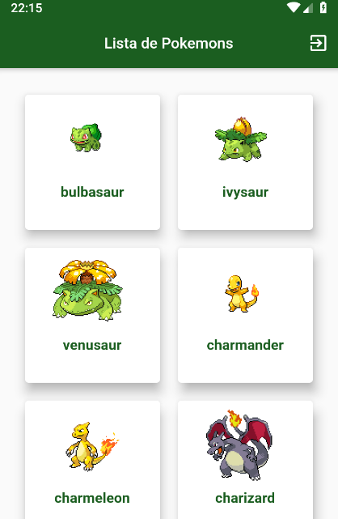

# Flutter Pokemons App

Pokemon application using the open api https://pokeapi.co/.

- The purpose of this application is learning in the flutter library.

## Screenshots (*application still under development*)

## Architecture

- **MVC** Architeture

- **Mobx** lib for state management

- **Modular** lib for control of named routes

## Getting Started in Flutter

For help getting started with Flutter, view our
[online documentation](https://flutter.dev/docs), which offers tutorials,
samples, guidance on mobile development, and a full API reference.

## Developer by

- **João Victor Piga** Developer mobile.

